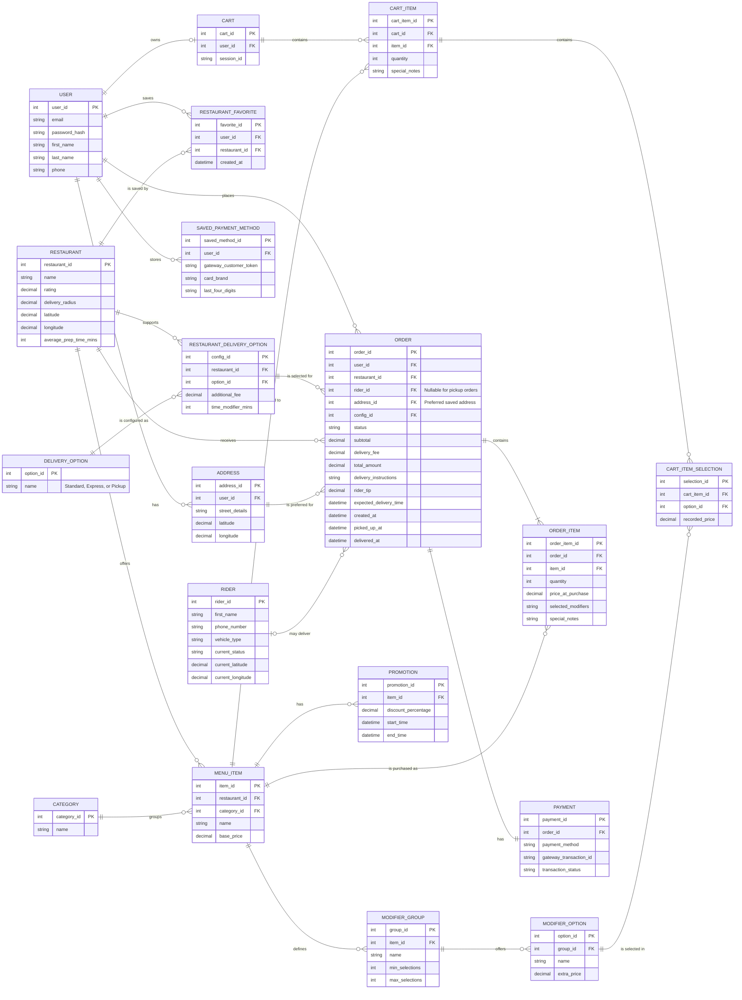

# Entity Relationship Diagram (ERD)

This diagram illustrates the complete database schema for the JavaEats Lite food delivery application, showing all entities, their attributes, and the relationships between them.

## Key Design Features

- **User Management**: Stores customer profiles, saved addresses, payment methods, and favorites
- **Restaurant Catalog**: Manages restaurant information, menus, categories, modifiers, and promotions
- **Shopping Cart**: Allows users to build orders with customizable menu items and modifiers
- **Order Processing**: Tracks orders from placement through delivery, including status and pricing
- **Delivery System**: Supports multiple delivery options and rider assignment for order fulfillment
- **Payment Integration**: Records payment transactions with support for saved payment methods
